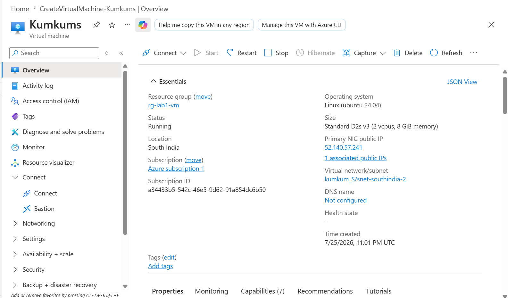
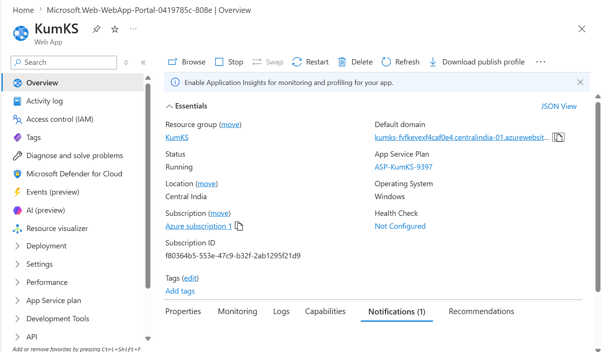

# ☁️ Azure Learning Journey


---

# 👋 About Me

Hi, I'm **Kumkum Sharma**.

I am an IT professional with **4+ years of experience** currently working as a **Major Incident Manager**. My goal is to transition into **Application Support** and **Azure Cloud Support** by building practical cloud administration and troubleshooting skills.

This repository documents my hands-on Azure learning journey through real deployments, troubleshooting, and project documentation while preparing for Azure Administration roles.

> 📌 Every project in this repository is based on hands-on Azure practice. Along with successful deployments, I document the challenges I encountered, how I investigated them, and the solutions I applied to strengthen my Azure troubleshooting skills.

# 🎯 Career Journey

```
Major Incident Manager
          │
          ▼
Application Support Engineer
          │
          ▼
Azure Cloud Support Engineer
          │
          ▼
Cloud Engineer
```

---

# 🛠 Technical Skills

### Cloud

- Microsoft Azure
- Azure Portal
- Azure Virtual Machines
- Azure App Service
- Azure Functions
- Azure Container Instances
- Azure Container Apps
- Azure Storage Account
- Azure Blob Storage

### Support & Monitoring

- ServiceNow
- Splunk
- Incident Management
- Major Incident Management
- Production Support
- Root Cause Analysis

### Operating Systems

- Linux Basics
- SSH Connectivity

### Other

- GitHub
- SQL Basics
- ITIL Framework

---

# 📚 Azure Hands-on Roadmap

| Azure Service | Status |
|--------------|--------|
| ✅ Azure Virtual Machine Deployment | Completed |
| ✅ Connect to Azure VM using SSH | Completed |
| ✅ Azure App Service Deployment | Completed |
| ✅ Azure Functions (HTTP Trigger) | Completed |
| ✅ Azure Container Instances (ACI) | Completed |
| ✅ Azure Container Apps | Completed |
| ✅ Azure Storage Account & Blob Storage | Completed |
| ⏳ Azure Virtual Network (VNet) | Planned |
| ⏳ Network Security Group (NSG) | Planned |
| ⏳ Azure Monitor | Planned |
| ⏳ Microsoft Entra ID | Planned |
| ⏳ Azure SQL Database | Planned |
| ⏳ Azure Load Balancer | Planned |
| ⏳ Azure Kubernetes Service (AKS) | Planned |

---

# 📂 Project Gallery

| Azure Virtual Machine | Azure App Service |
|------------------------|-------------------|
| [](projects/Azure-VM-Deployment.md) | [](projects/Azure-App-Service.md) |

| Azure Functions | Azure Container Instances |
|-----------------|---------------------------|
| [](projects/Azure-Functions.md) | [](projects/Azure-Container-Instances.md) |

| Azure Container Apps | Azure Storage & Blob Storage |
|----------------------|------------------------------|
| [](projects/Azure-Container-Apps.md) | [](projects/Azure-Storage-Account-and-Blob-Storage.md) |

---

# 🚀 Featured Projects

| Project | Description |
|---------|-------------|
| ☁️ Azure Virtual Machines | Deploy and manage Azure Linux Virtual Machines |
| 🌐 Azure App Service | Deploy web applications using Azure App Service |
| ⚡ Azure Functions | Build serverless applications with HTTP Triggers |
| 📦 Azure Container Instances | Deploy Docker containers without managing servers |
| 🚀 Azure Container Apps | Deploy scalable containerized applications |
| 💾 Azure Storage & Blob Storage | Securely store and share files using SAS |

---

# 🔧 Troubleshooting Experience

During my Azure hands-on labs, I successfully investigated and resolved several real-world issues.

| Issue | Status |
|-------|--------|
| Azure Regional Quota Limitation | ✅ Resolved |
| App Service Deployment Failure | ✅ Resolved |
| SSH Connectivity Issues | ✅ Resolved |
| Azure Subscription Limitations | ✅ Resolved |
| Blob Storage Public Access Error | ✅ Resolved |

📄 Detailed troubleshooting documentation is available in the repository.

---

# 📈 Learning Progress

```text
Azure Fundamentals      ██████████ 100%

Hands-on Projects       ████████░░ 80%

GitHub Documentation    ██████████ 100%

AZ-104 Preparation      ██░░░░░░░░ 20%
```

---

# 💡 Key Learnings

✔ Built hands-on experience with Microsoft Azure through real cloud deployments

✔ Deployed and managed Azure Virtual Machines, App Services, and Storage Accounts

✔ Developed serverless applications using Azure Functions

✔ Worked with containerized workloads using Azure Container Instances and Azure Container Apps

✔ Configured Azure Blob Storage and securely shared resources using Shared Access Signatures (SAS)

✔ Strengthened Linux administration and SSH connectivity skills

✔ Improved troubleshooting skills by resolving deployment, quota, networking, and storage access issues

✔ Practiced documenting cloud implementations using professional GitHub repositories

---

# 🏆 Certifications

- ✅ Microsoft Certified: Azure Fundamentals (AZ-900)
- ✅ ITIL® 4 Foundation

---

# 🎯 Current Learning Goals

- Azure Virtual Network (VNet)
- Network Security Groups (NSG)
- Azure Monitor
- Microsoft Entra ID
- Azure SQL Database
- Azure Kubernetes Service (AKS)

---

# 🤝 Connect With Me

**GitHub**

👉 https://github.com/kumkum-sharma27/Azure-learning-journey-

---

⭐ *This repository documents my practical Microsoft Azure learning journey through hands-on projects, troubleshooting, and cloud engineering best practices.⭐ 


---
