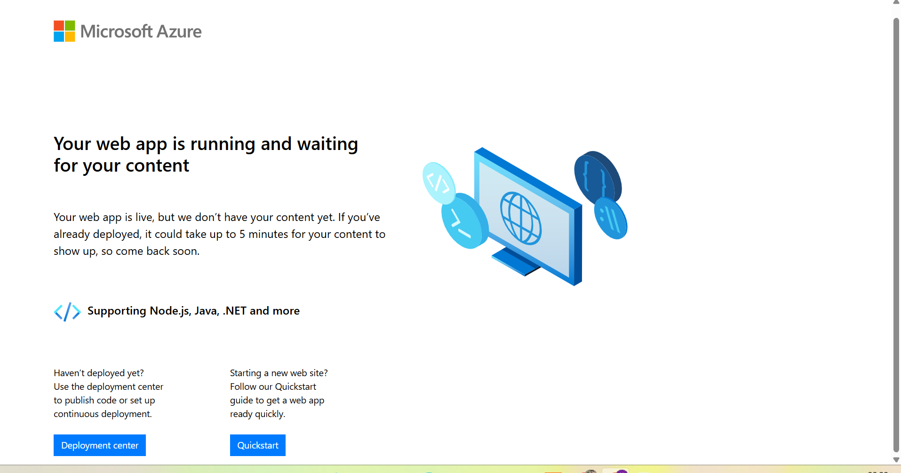

# Azure App Service Deployment

## 📌 Project Overview
This project demonstrates deploying a web application using **Azure App Service**.  
It covers subscription setup, quota management, provider registration, and verifying successful deployment.

---

## 🎯 Objective
- Create an Azure App Service  
- Deploy a sample web application  
- Verify successful deployment  
- Understand Platform as a Service (PaaS)  

---

## ☁️ Azure Services Used
- Azure App Service  
- Resource Group  
- Subscription Quota Management  

---

## 🚀 Deployment Steps
1. Signed in to Azure Portal  
2. Created a Resource Group  
3. Selected Azure App Service  
4. Configured the Web App (runtime stack, OS, region)  
5. Registered the **Microsoft.Web** provider  
6. Requested quota increase for **Compute-VM (cores-vCPUs)**  
7. Created the App Service Plan  
8. Successfully deployed the web application  
9. Verified the application using the provided URL  

---

## 📷 Screenshot Gallery

### Azure App Service Overview

### Running Web Application

---

## 🛠 Skills Demonstrated
- Azure App Service setup  
- Subscription quota management  
- Resource provider registration  
- Web Application Deployment  
- Azure Portal navigation  
- PaaS concepts  

---

## ✅ Outcome
Successfully deployed and verified a web application using Azure App Service.  
The app is live at the generated Azure URL, confirming the deployment process was completed end-to-end, including resolving quota and provider registration challenges.
