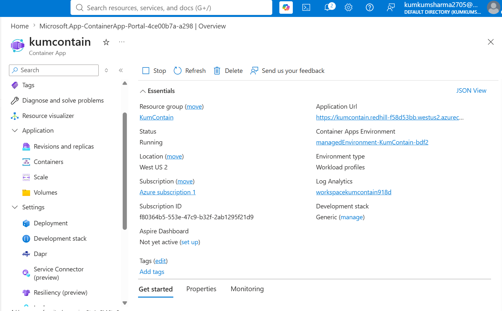
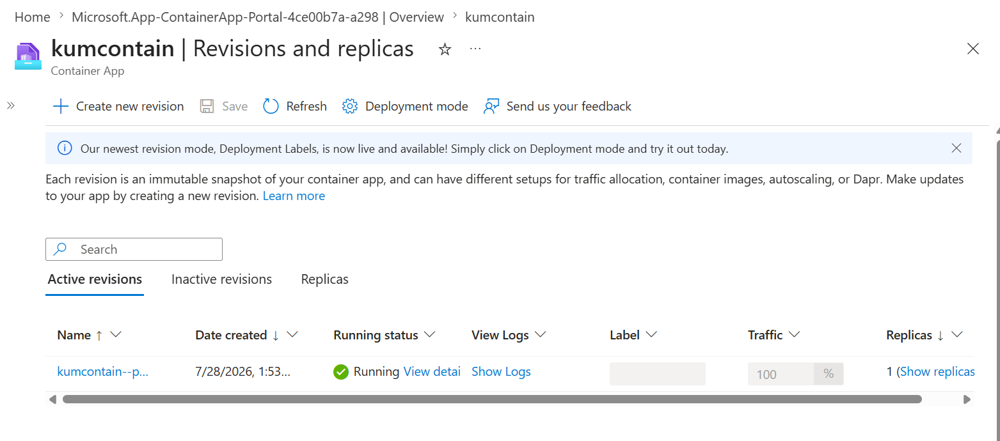
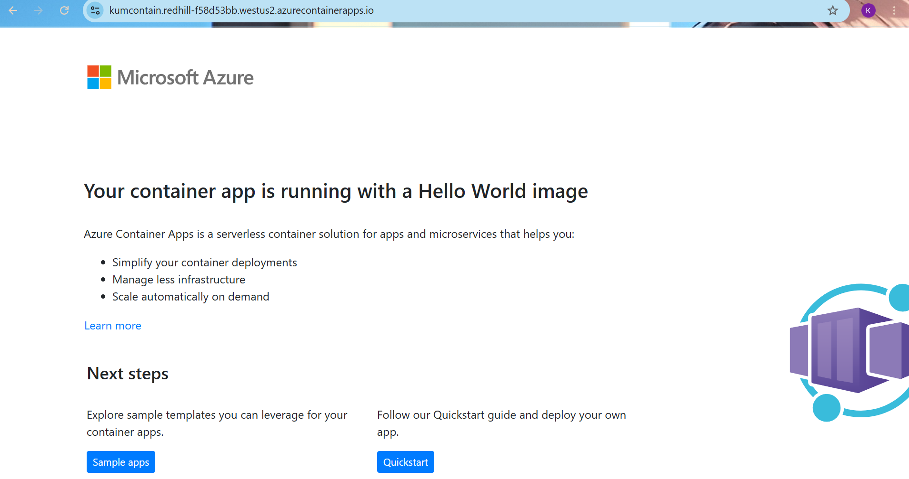

# 🚀 Azure Container Apps Deployment

## 📌 Project Overview

This project demonstrates deploying a containerized application using **Azure Container Apps**. The application was successfully deployed and verified using the generated application URL.

Azure Container Apps is a fully managed serverless platform for running containerized applications without managing Kubernetes infrastructure.

---

## 🎯 Objective

- Understand Azure Container Apps
- Deploy a containerized application
- Configure ingress to expose the application
- Verify successful deployment using the application URL
- Learn serverless container hosting in Azure

---

## ☁️ Azure Services Used

- Azure Container Apps
- Azure Container Apps Environment
- Resource Group
- Azure Container Registry (Public Image)

---

## 🚀 Deployment Steps

1. Signed in to the Azure Portal.
2. Created a Resource Group.
3. Selected **Azure Container Apps**.
4. Configured the Container App.
5. Selected the container image.
6. Enabled external ingress.
7. Created the Container App.
8. Waited for deployment to complete.
9. Opened the generated Application URL.
10. Successfully verified the deployment.

---

## 📷 Screenshots

### Azure Container App Overview

### Container App Running

### Application URL

---

## 🛠 Skills Demonstrated

- Azure Container Apps
- Container Deployment
- External Ingress Configuration
- Azure Resource Groups
- Azure Portal Navigation
- Application Verification

---

## 💡 Key Learnings

- Azure Container Apps simplifies running containerized applications without managing Kubernetes clusters.
- External ingress allows applications to be accessed over the internet.
- Azure automatically handles scaling and infrastructure management.
- Container Apps are well suited for microservices and modern cloud-native applications.

---

## 🌍 Real-World Use Cases

Azure Container Apps are commonly used for:

- Microservices
- REST APIs
- Backend services
- Event-driven applications
- Internal business applications
- Cloud-native workloads

---

## ✅ Outcome

Successfully deployed an Azure Container App and verified the deployment by accessing the generated application URL, which displayed the **"Hello World"** application. This confirmed that the containerized application was running successfully.

| Azure Service             | Best Used For                        |
| ------------------------- | ------------------------------------ |
| Azure Virtual Machine     | Full operating system control        |
| Azure App Service         | Web applications                     |
| Azure Functions           | Event-driven serverless code         |
| Azure Container Instances | Single container workloads           |
| Azure Container Apps      | Containerized microservices and APIs |
| Azure Kubernetes Service  | Large-scale container orchestration  |

