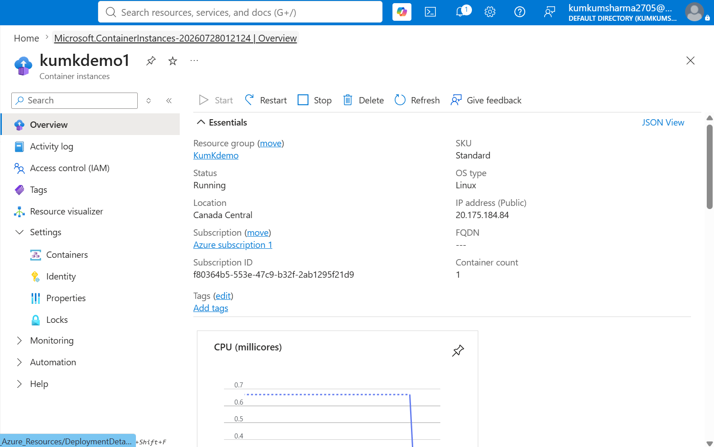
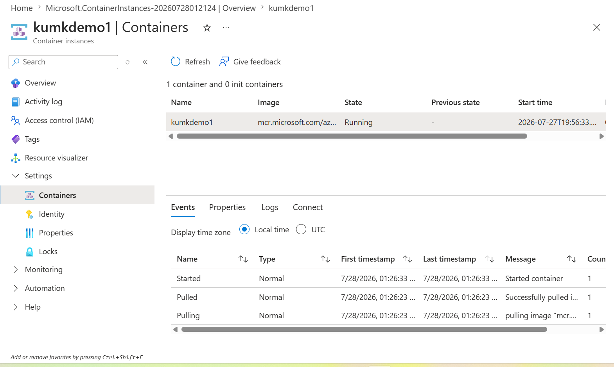

# 🐳 Azure Container Instances (ACI)

## 📌 Project Overview

This project demonstrates deploying a containerized application using **Azure Container Instances (ACI)**.

Azure Container Instances is a serverless container service that allows applications to run without managing virtual machines or Kubernetes clusters.

---

# 🎯 Objective

- Understand Azure Container Instances
- Deploy a containerized application
- Configure networking
- Verify application accessibility using the public IP address
- Learn container-based deployment in Azure

---

# ☁️ Azure Services Used

- Azure Container Instances (ACI)
- Resource Group
- Public IP Address

---

# 🚀 Deployment Steps

1. Signed in to the Azure Portal.
2. Created a Resource Group.
3. Selected **Azure Container Instances**.
4. Configured the container instance.
5. Selected the container image.
6. Assigned a public IP address.
7. Created the container instance.
8. Waited for deployment to complete.
9. Opened the public IP address in a web browser.
10. Successfully verified the deployment.

---

# 📷 Screenshots

### Azure Container Instance Overview

### Container Running

### Welcome Page

---

# 🛠 Skills Demonstrated

- Azure Container Instances
- Container Deployment
- Public IP Configuration
- Azure Resource Groups
- Azure Portal Navigation
- Application Verification

---

# 💡 Key Learnings

- Azure Container Instances provide a fast way to run containers without managing servers.
- Applications can be exposed through a public IP address.
- Containers start quickly and are ideal for lightweight workloads and testing.
- Azure automatically manages the underlying infrastructure.

---

# 🌍 Real-World Use Cases

Azure Container Instances can be used for:

- Running containerized web applications
- Background processing
- Batch jobs
- APIs
- Development and testing
- Event-driven workloads

---

# ✅ Outcome

Successfully deployed a containerized application using Azure Container Instances.

Verified the deployment by accessing the container through its public IP address, which displayed the default **"Welcome to Azure Container Instance"** web page, confirming that the container was running successfully.
