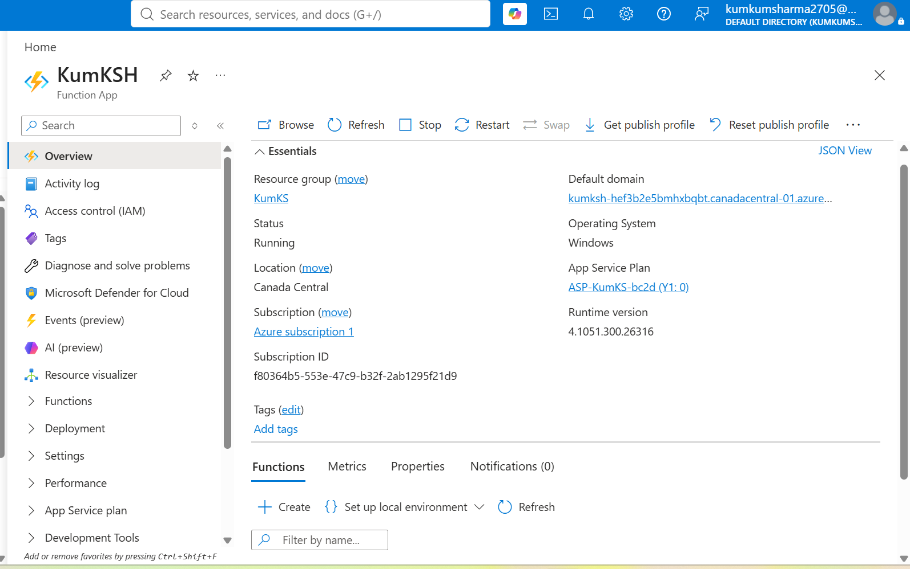
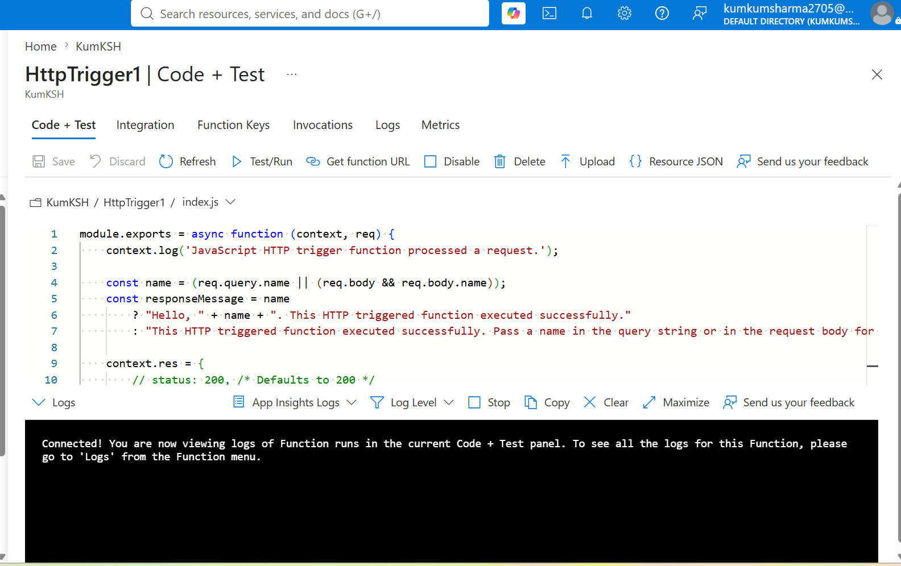
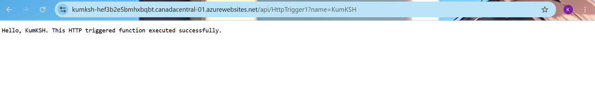

# ⚡ Azure Function App with HTTP Trigger

## 📌 Project Overview

This project demonstrates creating an **Azure Function App** with an **HTTP Trigger** using Microsoft Azure. The function was successfully deployed and tested by invoking its generated HTTP endpoint.

---

## 🎯 Objective

- Understand Azure Functions
- Create a serverless Function App
- Configure an HTTP Trigger
- Test the function using the generated URL
- Learn the basics of serverless computing

---

## ☁️ Azure Services Used

- Azure Functions
- HTTP Trigger
- Azure Storage Account
- Resource Group

---

## 🚀 Deployment Steps

1. Signed in to the Azure Portal.
2. Created a new Resource Group.
3. Created an Azure Function App.
4. Selected the appropriate hosting plan for the Function App.
5. Created a new **HTTP Trigger** function.
6. Generated the Function URL.
7. Copied the Function URL.
8. Opened the URL in a web browser.
9. Successfully verified that the Azure Function executed.

---

## 📷 Screenshots

### Azure Function App Overview

### HTTP Trigger Function

### Function Executed Successfully

---

## 🛠 Skills Demonstrated

- Azure Functions
- Serverless Computing
- HTTP Trigger
- Resource Group Management
- Azure Portal Navigation
- Function URL Testing

---

## 💡 Key Learnings

- Azure Functions enable serverless application execution without managing virtual machines.
- HTTP Triggers allow functions to be invoked using an HTTP request.
- Azure automatically provisions and manages the required infrastructure.
- Function Apps can be tested directly using the generated endpoint URL.

---

## ✅ Outcome

Successfully created an Azure Function App with an HTTP Trigger and verified its execution by accessing the generated Function URL in a web browser. This hands-on exercise provided practical experience with Azure's serverless computing capabilities.
