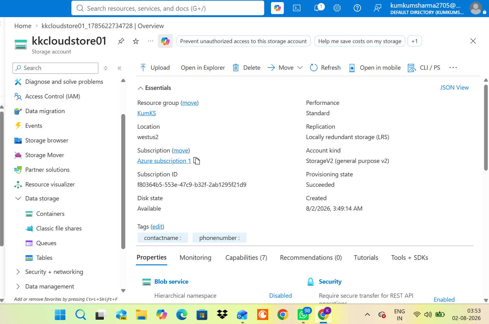
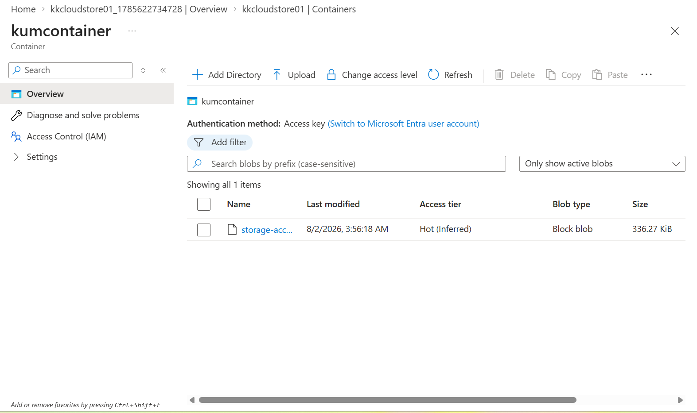
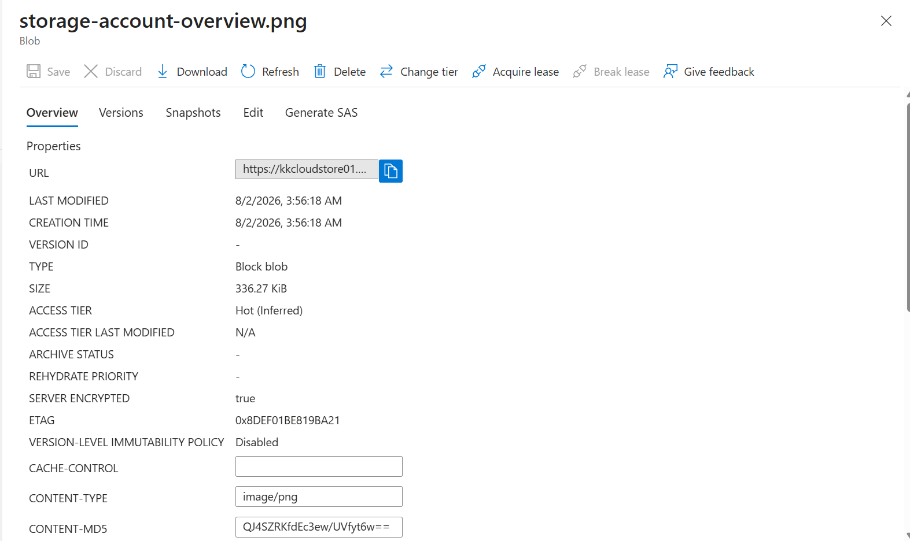
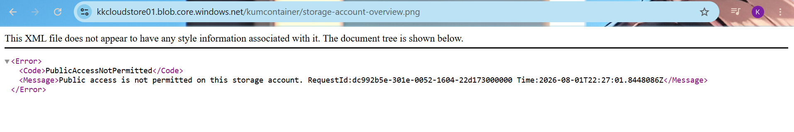
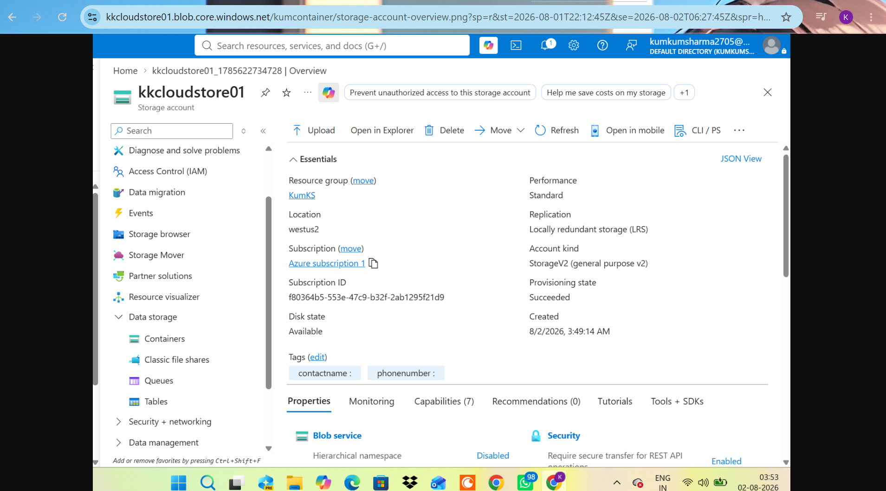

# 💾 Azure Storage Account & Blob Storage

## 📌 Project Overview

This project demonstrates creating an **Azure Storage Account**, creating a **Blob Container**, uploading files to Azure Blob Storage, and securely accessing uploaded files using a **Shared Access Signature (SAS)**.

During testing, I encountered the **PublicAccessNotPermitted** error when attempting to access the uploaded blob using its direct Blob URL. The issue was successfully resolved by generating a **Shared Access Signature (SAS)** with Read permissions.

---

## 🎯 Objective

- Understand Azure Storage Accounts
- Create a Blob Container
- Upload files to Azure Blob Storage
- Understand Blob URL access
- Generate a Shared Access Signature (SAS)
- Securely access private blobs

---

## ☁️ Azure Services Used

- Azure Storage Account
- Azure Blob Storage
- Blob Containers
- Shared Access Signature (SAS)
- Azure Portal

---

## 🚀 Deployment Steps

1. Signed in to the Azure Portal.
2. Created a new Resource Group.
3. Created an Azure Storage Account.
4. Created a Blob Container.
5. Uploaded an image to Azure Blob Storage.
6. Copied the Blob URL and attempted to access the uploaded file.
7. Received the **PublicAccessNotPermitted** error because public access was disabled.
8. Generated a **Shared Access Signature (SAS)** with Read permission.
9. Opened the generated SAS URL in a browser.
10. Successfully accessed the uploaded blob.

---

## 📷 Screenshots

### Azure Storage Account Overview

---

### Blob Container Created

---

### File Uploaded to Blob Storage

---

### Public Access Error

Attempting to access the uploaded blob directly using the Blob URL resulted in the following error because public access is disabled.

---

### Blob Access Using SAS URL

After generating a Shared Access Signature (SAS), the uploaded blob became securely accessible through the generated URL.

---

## 🛠 Skills Demonstrated

- Azure Storage Account
- Azure Blob Storage
- Blob Container Management
- Shared Access Signature (SAS)
- Azure Storage Security
- Azure Portal
- Cloud Storage Management
- Blob URL Testing

---

## 💡 Key Learnings

- Azure Storage Accounts provide secure cloud-based object storage.
- Blob Containers are used to organize and store files.
- Public access is disabled by default for enhanced security.
- Direct Blob URLs cannot access private blobs without authorization.
- Shared Access Signature (SAS) provides secure, time-limited access to storage resources.
- SAS URLs enable secure file sharing without exposing Storage Account keys.

---

## ✅ Outcome

Successfully created an Azure Storage Account, uploaded files to Azure Blob Storage, understood Azure Storage security, resolved the **PublicAccessNotPermitted** error, and securely accessed the uploaded blob using a **Shared Access Signature (SAS)**.

---

## 🌍 Real-World Use Cases

Azure Blob Storage is commonly used to:

- Store application images and documents
- Host static website assets
- Store application backups
- Archive logs and media files
- Securely share files using Shared Access Signatures (SAS)
- Integrate with Azure Functions, App Services, Container Instances, and Container Apps
