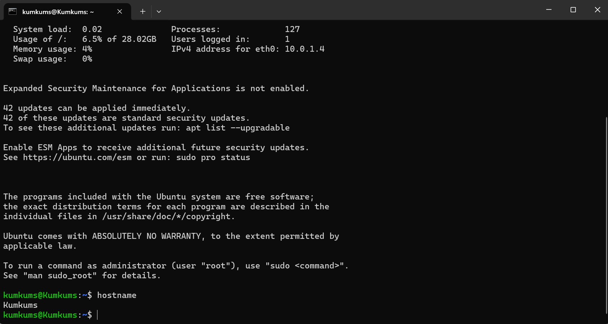

# Azure Virtual Machine Deployment

## Project Overview

This project demonstrates deploying an Ubuntu Linux Virtual Machine in Microsoft Azure and successfully connecting using SSH.

---

## Objective

- Deploy Azure VM
- Configure Networking
- Assign Public IP
- Connect via SSH
- Verify Linux VM access

---

## Azure Services Used

- Azure Virtual Machine
- Virtual Network
- Network Security Group
- Public IP
- Resource Group

---

## Architecture

Azure Portal

↓

Resource Group

↓

Virtual Network

↓

Ubuntu Virtual Machine

↓

SSH Connection

---

## Deployment Steps

1. Created Resource Group
2. Created Ubuntu VM
3. Assigned Public IP
4. Configured NSG
5. Connected using SSH
6. Verified successful deployment

---

## Screenshots

### Azure VM Running


### SSH Connected



---

## Commands Used

```bash
hostname
whoami
pwd
```

Output

```text
hostname
Kumkums

whoami
kumkums

pwd
/home/kumkums
```

---

## Skills Demonstrated

- Azure Portal
- Virtual Machines
- Linux
- SSH
- Networking
- Azure Administration

---

## Outcome

Successfully deployed and accessed an Ubuntu Linux VM on Microsoft Azure using SSH.
