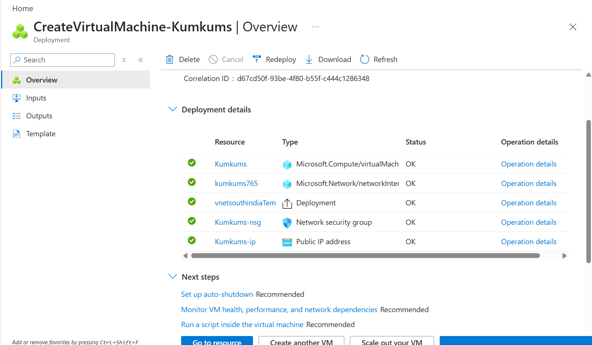

# Azure Virtual Machine Deployment

## Objective

Deploy a Windows Virtual Machine in Microsoft Azure Portal.

## Azure Services Used

- Virtual Machine
- Resource Group
- Virtual Network
- Network Security Group
- Public IP Address

## Steps Performed

1. Created Resource Group
2. Created Windows Virtual Machine
3. Configured Networking
4. Connected using RDP
5. Verified successful deployment

## Deployment Screenshot

## Outcome

Successfully deployed a Windows Virtual Machine in Azure.
